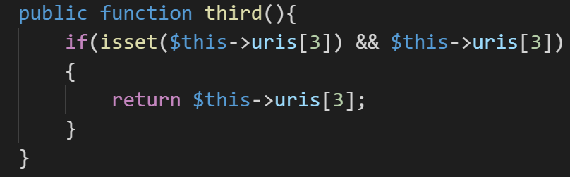
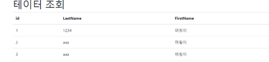
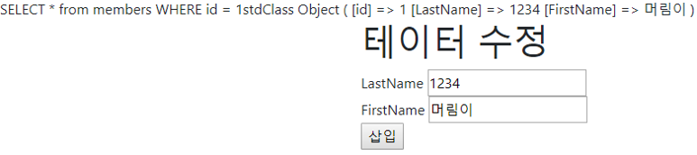
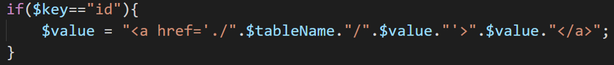
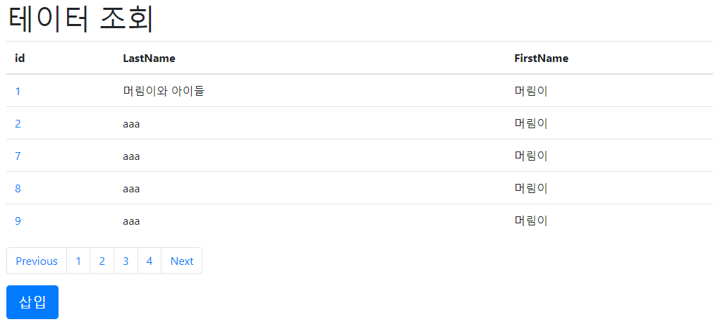
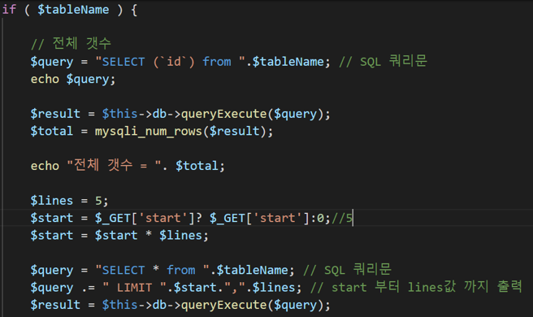

# 2019.11.13 (10주차)

## PHP 정리 데이터베이스

1. 배열에 데이터를 넣고 3번째에 값이 존재할시에 그 3번째 값을 반환 한다.

2. 반환 받은 배열의 3번째 값이 숫자인지 문자인지 확인하고 숫자이면 실행되는 조건문들 수행한다. url의 값이 /1 이러한 형식이 아니라 url에 / 를 한다면 존재하는 값이 없기에 실행 하지 않는다.

3. 수정 하기 전과 후를 알수있도록 값을 출력한다.

4. 이후 내용의 수정을 위해 기존 코드 들을 연상배열로 변경한다.

5. 변경은 기본적으로 0보다 큰값일때 true 라면 으로 코드가 진행된다. 기본적으로 시작하면 배열을 초기화 하여 기존 배열에 추가되는것을 방지한다.

6. 초기화된 배열에 key 값을 가지는 프로퍼티에 value 값을 지정한다. $arr[$key] = $value; 이게 연상 배열이다.

7. 배열을 추가하는대 $row 에 직접 넣지 않고 가공하여 임시 배열인 $arr을 사용한다. $row[] = $arr

8. 기존 방식대로라면 수정 페이지로 이동하기 위해 URL에 직접 수정할 값의 id를 작성해야한다. 기존과는 다르게 id부분에 이동이 가능하게 변경되어 있는걸 볼수있다.

9. 수정만 있고 삭제가 없다면 안된다. 삭제를 위한 태그를 생성한다. 페이지를 삭제하기 위한 쿼리를 작성한다. 그리고 부트스트랩에서 디자인을 스크랩하여 가져온다.

10. html에서 메시태그로 값을 변경하는대 사용하는 변수 content에 방금 스크랩한 값을 추가한다. 하단에 123 Next 같은것이 생긴것을 확인 할수있음.

11. line을 5개로 지정했고 start를 0으로 지정해서 한 페이지에 5개씩 데이터가 출력한다. 5개씩 데이터를 출력하는 페이지의 구현은 되었으나 아래 페이지를 이동버튼을 눌러도 페이지의 이동이 구현이 되어있지 않았다.

12. 이유는 아직 페이지를 이동시킬수있는 경로가 지정되어있지 않기 때문이다. 경로부분에 변수를 넣고 첫번째 페이지일때 0이 출력되게 한다. 페이지를 이동하기 위해 기존 스크립트를 수정함.

13. 각각의 페이지에 5개의 데이터가 정상적으로 출력이 되고 페이지 이동이 가능해진다.

