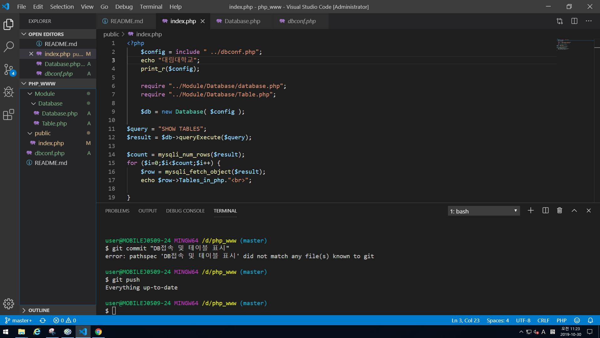
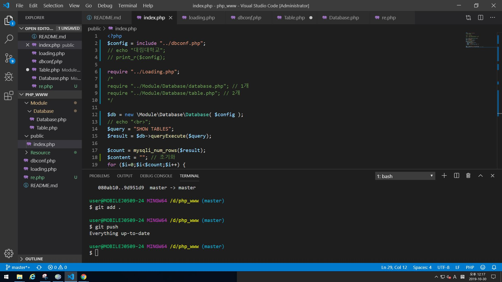

# 2019.10.30 (8주차)

## PHP 정리 데이터베이스

1. 기초부터 데이터 베이스를 만들기 시작한다.
2. 기존 폴더에 있던 데이터 베이스 파일들을 냅두고 PHP_www 폴더를 생성 한다.
3. 그 폴더에 READE.md 파일을 만든뒤 맨 아래에 있는 사진에 보이듯이 문구를 기입한다.
4. 그뒤 PHP_www 하위 폴더에 public 폴더를 생성 index.php 파일 생성후 간단하게 확인한다.
5. Module 폴더 생성 그 하위 폴더로 Database 폴더를 생성한다.
6. 기존 폴더에 있는 database.php, Table.php, dbconf.php 파일을 복사 붙여넣기 한다.
7. 간단하게 수정후 롤컬 서버를 열어 확인한다.
8. 다시 쓰는 git
9. git status를 하면 빨간 줄로 몇가지의 파일이 나타난다.
10. git add . 을 입력후 엔터를 누른뒤 다시 git status를 입력하면 빨간색이었던 글씨들이 초록색으로 나타난다.
11. 그 다음 git push 를 하면 되는대, 글로벌이 아니라면 해야할 것이 있다.
12. git commit -u origin master 을 하면 되는대 설명란에 한번에 추가하려면
13. git commit "dasdsa" 라는 식으로 입력을 한다면 저장소에 dasdsa라는 정보가 나타난다.
14. 이제 git push를 하면 업로드가 된다.
15. 웹 사이트를 만드는 방법은 여러가지 이지만 수업방식에 따라 php와 html만 사용한다. 
16. 그전에 require에서 링크를 ../Module 어쩌구 하기 귀찮기도 하고 오래걸리니까 Table.php파일과 Database.php파일 최상단 그러니까 <?php 바로 아랫줄에 입력하면 된다. 네임 스페이스 namespace 코드를 입력하고 namespace Module\Database; 하면 된다.
17. 현제 사진에는 쿼리 실패 mysql에 접속이 안되는대 학교에서 수업받는 PC에는 mysql이 깔려있지 않다.
18. 노트북은 아쉽게도 mysql이 깔려있지만 php수업을 받으며 초기에 했던 작업을 하지 못했다. 그래서 다른 자리의 PC로 구동해보니 제대로 작동하는것을 확인했다.
19. 혹시나 부트스트랩은 무엇인가? 라고 한다면 부트스트랩은 반응형 웹을 만들수있고 모바일 우선인 웹 프로젝트 개발을 위한 가장 인기있는 HTML, CSS,JS 프레임워크입니다.
20. 아주 쉽게 말하자면 웹페이지를 제작하는대에 있어 코딩의 양을 엄청나게 줄여준다.
21. 다시 돌아와서 mysql 성공시 쿼리 성공 등등 연결이 되었으니 출력되는 문구는 전부다 주석처리를 하였다. 성공되었는대 눈으로 또 확인할 수단은 한두가지가 아니니까.
22. 그리고 mysqli_num_rows() 라는 코드가있는데 이것은 함수는 리절트 셋(result set)의 총 레코드 수를 반환 한다. 사용방법은 mysqli_num_rows($result);이다.
23. mysqli_fetch_object()는 결과 집합에서 현재 행을 얻기위해 기능 및 객체로 돌아간다. 참고할 사항은 이 함수에 의해 반환 필드 이름은 대소 문자를 구분한다.
24. file_get_contents은 php로 웹상의 파일 읽기 이다.
25. 아래는 수업을 들으며 따라가며 캡처한 사진들이다.
26. ---사진---

