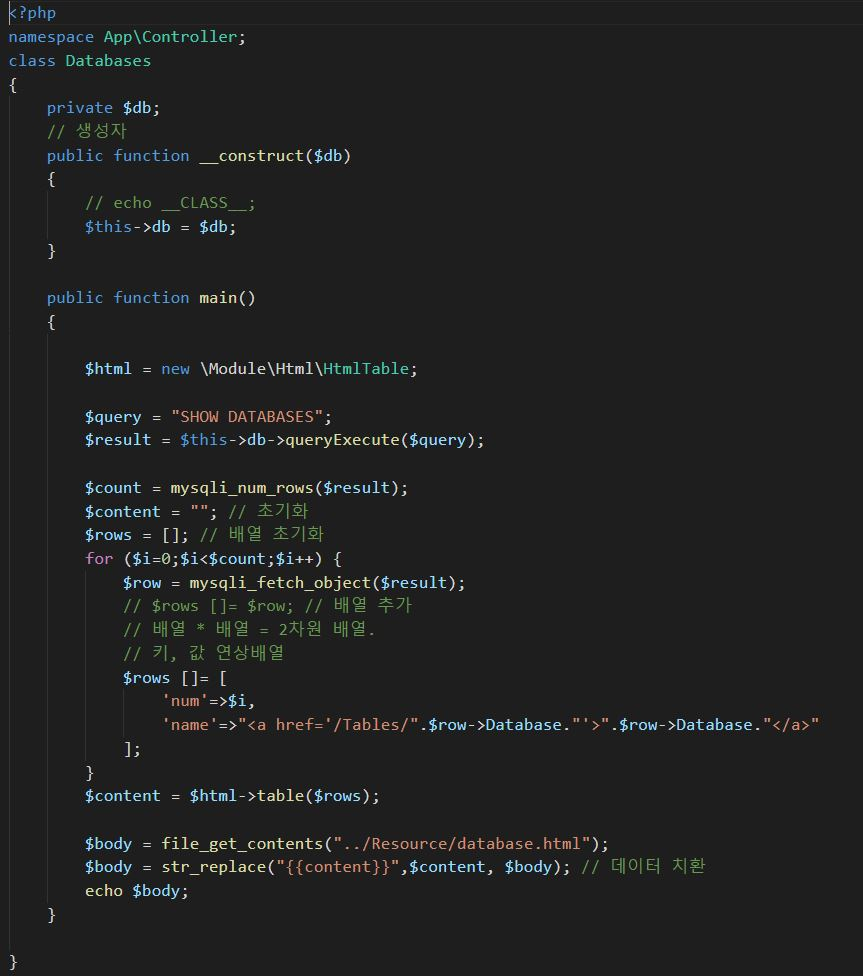
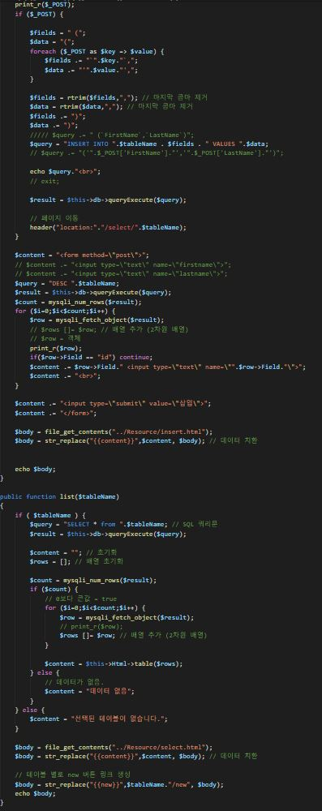
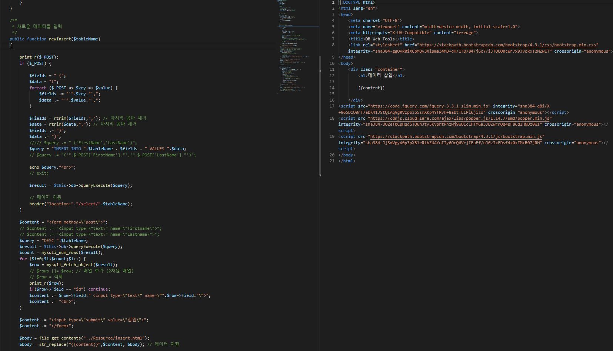
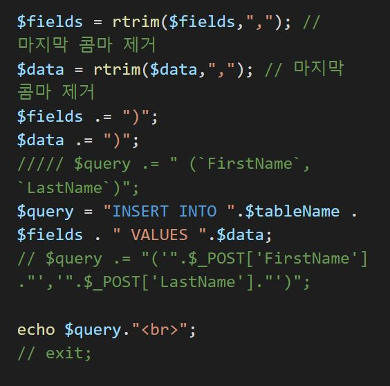
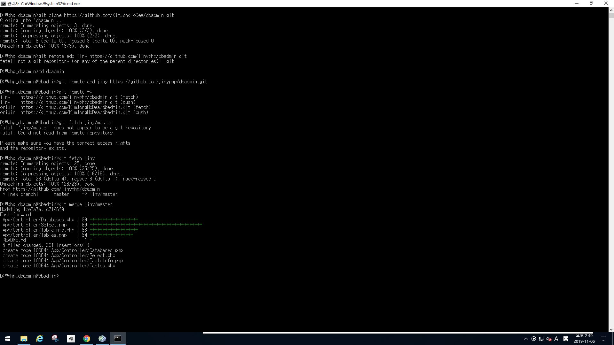

# 2019.11.06 (9주차)

## PHP 정리 데이터베이스

1. 오늘은 간단하게 DB SQL 문장을 코딩으로 만들어서 데이터 조회를 알아보았다.
2. MySQL을 활용하여 데이터 조회 로그인 등 을 하였다.
3. 가장 처음에 한 수업은 Databases.php에 Tables.php처럼 DB의 목록들을 출력한다.

4. 테이블.php와 똑같이 디비.php를 만들었으니까 리소스 폴더에있는 html도 똑같이 만들어두고 경로를 수정한다.

5. 이제 Uri부분이다.
6. $connect = @mysql_connect("localhost", "DB아이디","DB비밀번호") or die("DB접속에러"); 라는 식으로 사용하는 포스팅도 보았다.

7. DB -> Table -> Query 순으로 호출해야 한다.

8. Mysql은 결과를 fetching하는 방식이 두가지가 있다.

9. mysql_fetch_array:$row[user_id];
10. mysql_fetch_array:$row[2];

11. 이렇게 두개가 있다. array는 실제 컬럼명으로 fetch할수있고 rows는 컬럼 번호별로 fetch할수있다.

12. 중요한것은 순서이다. DB선택을 하고 DB를 연결한다. Query를 전송하고 return된 Query Fetch 순서이다.

13. 데이터 삽입기능을 간편하게 만들자. DB에서 받아온 값을 $에 변수로 들어가게 되는데 $row의 DB열을 선택하고 그안에 필드의 값이 ID일 경우 계속해서 다음으로 코드를 추가한다.

14. 삽입 쿼리를 최적화 하기 위해서는 교수님께서 알려준 방법들 보다 굉장히 많은방법이 있다는것을 알았다.

