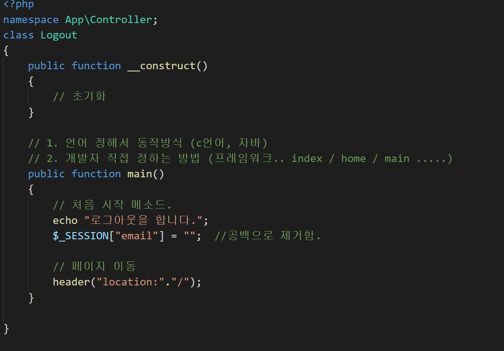

# 2019.11.20 (11주차)

## PHP 정리 데이터베이스

1. PHP_WWW폴더안에 있는 파일 로그인 방식 언어를 정해서 동적 방식으로 진행됨(C언어, 자바등)

2. 개발자가 직접 정하는 방법은(프레임워크..index/ home / main ...)이다. 메소드를 만들고 문자열과 배열로 출력을 시키면 성공.

3. 로그인만 하면 안되고 로그인을 했을때 체크하고 저장하는 슈퍼 세션 변수 값을 저장함

4. 포스트란??

    - 메시지 헤더를 통해서만 전달한다.
    - request 라인의 URI필드를 통해서 전달함.
    - 데이터의 크기에 한계가 있음/ 헤더의 크기를 넘어 갈 수 없다.
    - 전달하려는 데이터가 외부에 노출되어서 보안상 취약하다.
 5. 포스트 메서드란?

    - 메시지 바디가 있고 바디를 통해서 데이터를 전달한다.
    - 전달하려는 데이터의 크기의 제한이 없다.
    - 전다하려는 데이터가 외부에 쉽게 노출되지 않는다.
    - 반드시 form 태그가 있어야한다(회원가입, 로그인 등등)
6. GET은 url로 값을 넘기고 POST는 form로 값을 넘긴다. 두가지의 차이를 설명하자만 클라이언트에서 서버로 데이터를 전송할때 쓰이는것 이다.

7. 각각의 페이지 간에 정보를 주고받을때 사용한다.

8. 의문점은 post가 양도 많이 주고 받을수 있고 사용자에게 정보도 노출되지 않아 좋은데 그냥 다 post를 쓰면 되지 왜 get을 쓰는가??

    - GET은 가져오는것
    - POST는 수행하는것
    - GET은 선택적인 성향이기 때문에 어떠한 데이터를 가져와서 보여주는 개념이다.
    - GET은 그렇기 때문에 서버의 값이나 상태등을 바꾸지 않는다.
    - 예를 들면 게시판의 리스트나 글보기 기능 같은것에 해당된다.
    - POST는 서버의 값이나 상태를 바꾸기 위해서 사용된다.
    - 에를 들면 글쓰기를 하면 글의 내용이 DB에 저장이 되고 수정을 하면 DB값이 수정되는데 이럴경우에는 POST를 사용한다.

9. 구분할 필요가 없다 라고 생각 된다면 더 아래쪽 설명을 보자.

10. 단순히 참고만 할것...

    - Google과 Accelerator 얘기가 대표적인 예시라고 한다.
    - 우선 차이점은
    - 1.전송속도 GET > POST
    - 2.히스토리 백 할 때 GET는 이전데티어를 보여주며, POST는 새로 요청하는것.
    - 3.인코딩 방식이 다르다.
    - 4.GET은 글자수 제한이 있고 POST 는 없다.
    - 5.GET은 보안에 취약, POST는 보안유지
    - 6.GET은 서버의 데이터를 가져오는데에 적합하고 POST는 게시판의 글을 등록/수정하는 것과 같은 작업에 적합함.

11. 여기까지가 POST와 GET의 차이점 및 장단점 그리고 사용 되는 예시까지이다.

