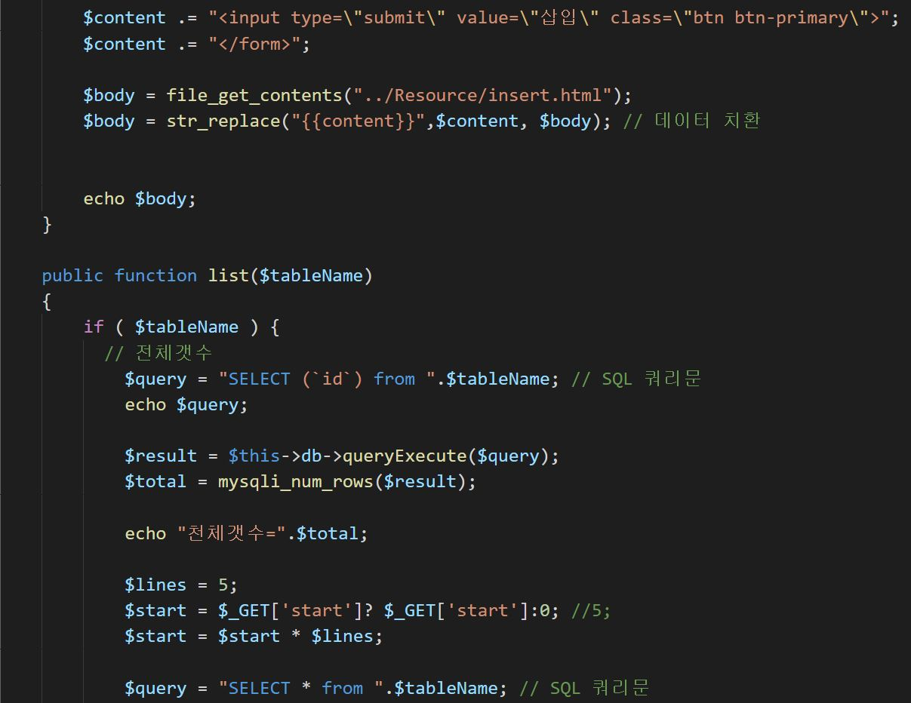
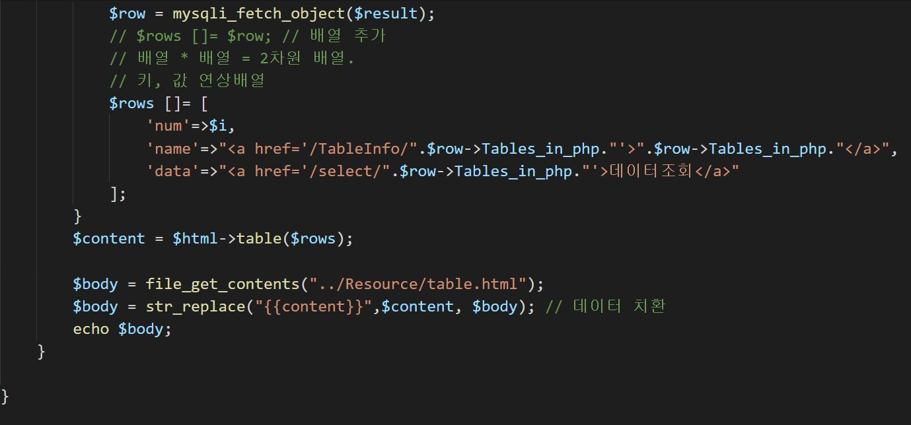

# 2019.11.27 (12주차)

## PHP 정리

1. php 추상 메소드 & 추상 클래스

    - php 에서는 최소한 하나 이상의 추상 메소드를 포함하는 클ㄹ스를 추상 클래스라고 한다.(abstract class)
    - 추상 클래스는 객체 지향 프로그래밍에서 중요한 특징인 다형성을 가진 메소드의 집합을 정의할 수 있게 해준다.
    - 반드시 사용되어야 하는 메소드를 추상 클래스에 추상 메소드로 선언 해둔다.
    - 클래스를 상속받는 모든 클래스에서는 이 추상 메소드를 반드시 재정의 해야한다.

2. 이런 추상클래스는 동작이 정의되어 있지 않은 추상 메소드를 포함하고 있으므로, 인스턴스를 생성할 수 없다.

3. 추상 클래스는 먼저 상속을 통해 자식 클래스를 만들고, 만든 자식 클래스에서 추상 클래스의 모든 추상 메소드를 오버라이딩 하고 나서야 자식클래스의 인스턴스를 생성 할수 있다.

4. 인터페이스
    
    - PHP에서 인터페이스(interface)란 다른 클래스를 작성할 때 기본이 되는 틀을 제공하면서, 다른 클래스 사이의 중간 매개 역할도 담당하는 일종의 추상 클래스를 의미한다.
    - 인터페이스를 사용하면 클래스가 반드시 구현해야 할 메소드가 어떻게 동작하는지를 알 필요 없이 다른 부분의 코드를 작성할 수 있다.
    - 인터페이스를 사용하면 클래스가 반드시 구현해야 할 메소드가 어떻게 동작하는지를 알 필요 없이 다른 부분의 코드를 작성할 수 있다.
    - 인터페이스를 구현하는 클래스는 인터페이스의 모든 메소드를 구현해야 한다.
    - 구현되는 메소드는 인터페이스에서 정의된 모든 메소드를 구현해야 한다.

5. 인터페이스와 추상 클래스의 공통점, 차이점은?

 6. 공통점
    
    - abstract class(추상 클래스)와 interface 는 선언만 있고 구현 내용이 없는 클래스이다.
    - 자기 자신이 new를 해서 객체를 생성할 수 없다
    - 추상클래스를 extends 받거나, interface를 implements 한 자식만이 객체를 생성할 수 있다.
    - 상속받은 자식이 구현을 반드시 하도록 해야할 때 사용한다.

 7. 차이점
    
    - 추상클래스는 말그대로 클래스이고, interface는 구현하기 전에 메소드에 명시된 것이다.
    - 상속을 받음에도 불구하고 클래스에선 상속이라고 쓰지만 interface는 implemets(구현) 이라고 한다.
    - 추상클래스의 정의는 abstract메소드가 하나라도 존재하는 클래스를 일컫는다.
    - 일부는 구현된 메소드도 있고, abstract라고 붙어있는 메소드는 구현이 안되어있다.
    - 추상 클래스를 상속받는 클래스는 반드시 추상메소드를 구현해야한다.
    - 필수적으로 구현해야할 메소드가 있을 때 추상 클래스를 쓰게된다.
    - 인터페이스는 구현체 없이, 메소드에 대한 명시만 되어있다.
    - 필수적으로 구현해야할 메소드가 있을 때 추상 클래스를 쓰게된다.
 
8. mvc 패턴이란?
    
    - mvc패턴은 프로그램의 관심사를 모델, 뷰, 컨트롤러의 세가지 구성요소로 나누는 설계 패턴이다. 각 구성요소는 다음과 같은 역활을 한다.
    - 모델은 컨트롤러에 의해 호출되어 데이터 소스에 데이터를 저장하거나 데이터소스에서 데이터를 가져와서 뷰가 사용할 수 있는 형태로 컨트롤러에 반환한다.
    - 뷰는 컨트롤러에 의해 호출되어 클라이언트에게 응답으로 제공할 템플릿(HTML,XML,JSON등등)을 생성해서 컨트롤러에 반환한다.
    - 컨트롤러는 사용자의 요청을 처리하고 응답을 되돌려주는 전체과정을 관장한다.

9. mvc패턴이 적용된 웹 어플리케이션은 일반적으로 비슷한 순서로 처리됨.
    
    - 1.사용자가 브라우저를 통해 요청을 전송하면 컨트롤러가 받는다.
    - 2.컨트롤러가 모델에게 데이터 처리를 요청한다.
    - 3.모델은 처리된 데이터를 컨트롤러에 반환한다.
    - 4.컨트롤러는 모델로부터 되돌려받은 데이터를 뷰에 전달한다.
    - 5.뷰는 응답을 생성하여 컨트롤러에 반환됨.
    - 6.컨트롤러가 브라우저에 뷰로부터 되돌려받은 응답을 전송함.

10. mvc패턴을 사용하면 좋은 점

    - mvc패턴을 잘 적용하면 관심사 분리에 따른 장점을 얻을수 있다.
    - 즉 개별 부문을 이해하기 쉬워지고, 각 부문을 재사용할 수 있게 되며, 다른 부문에 대해 신경 쓸 필요가 없어져 유지보수와 협업이 쉬워진다.

11. 아래는 스크린샷

12. 이 아래는 각 php 파일들의 소스코드이다. 

